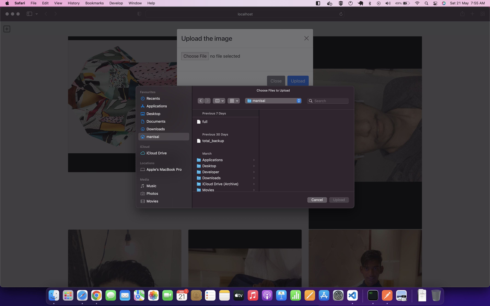

# Image_Uploader

Frontend - built in React

- Upload an image with modal
- Frontend sends image to backend
- Success modal upon completion
- Failure modal upon failure
- Feed that refreshes when page refresh or when upload completes with all images

Backend - built in Flask

- Endpoint to receive image

- Saves two images to Disk
  > Original Image

> Image tiled 90 degrees to left

- Update DB with list of all images
- Returns 200 for upload
- Returns a feed of all images
- Returns a feed of all images in reverse chronological order based on upload time

### Screenshots

